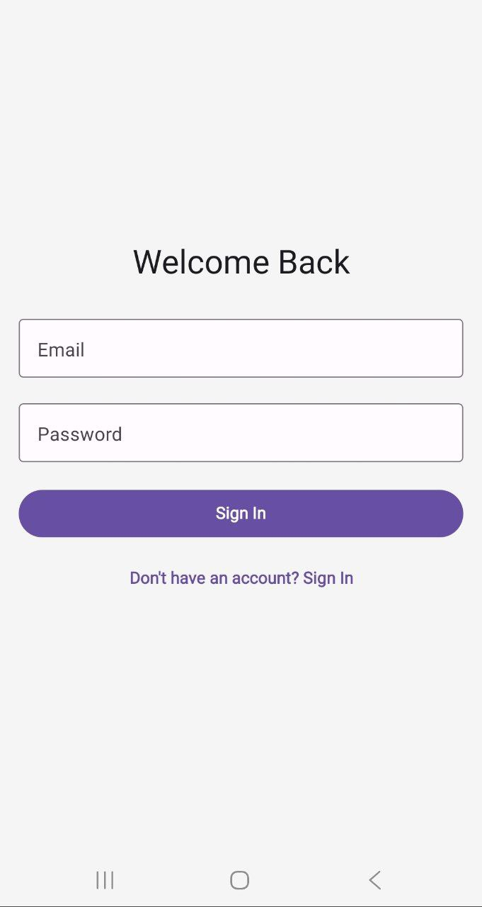
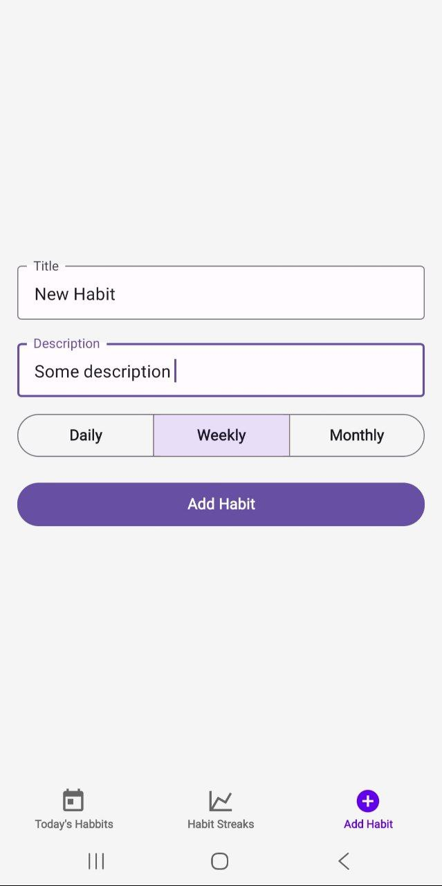
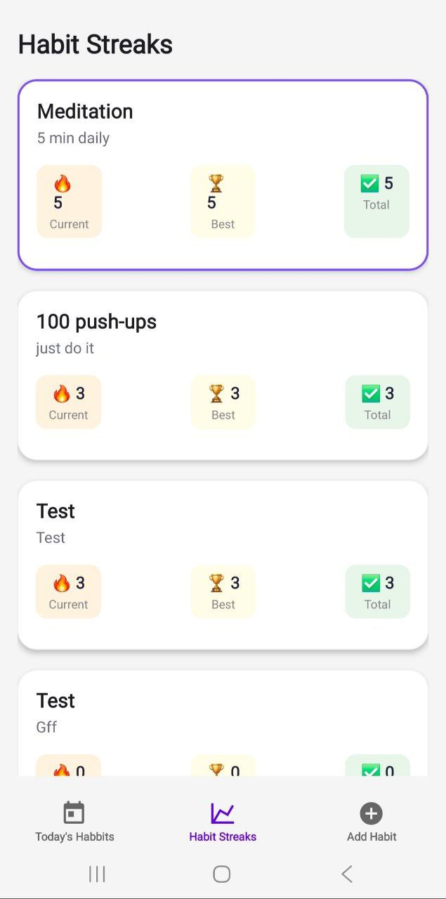
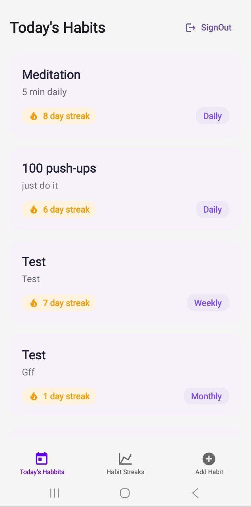
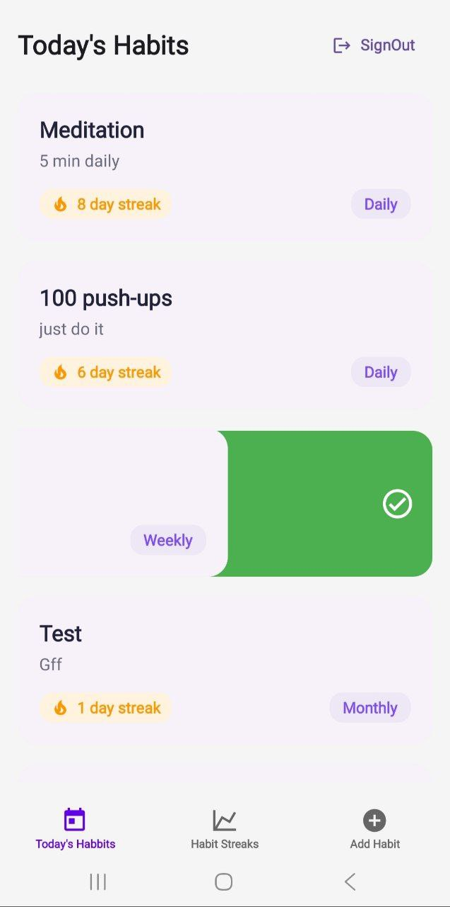
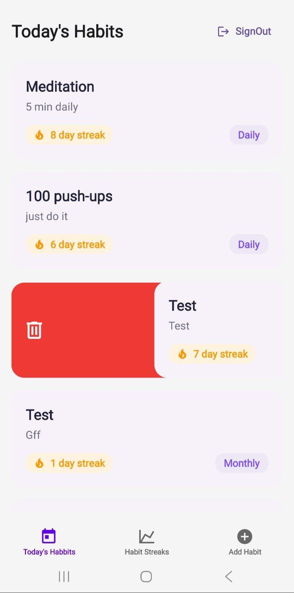

# 📱 Habit Tracker — React Native App

A simple mobile **habit-tracking application**, built as a learning project to explore **React Native** technologies and mobile app architecture.

---

## 🧭 Overview

This project is a minimal habit tracker where users can add, track, and manage daily habits. It’s primarily focused on learning the React Native ecosystem and building cross-platform applications with Expo.

---

## 🛠️ Tech Stack

- **React Native** — cross-platform mobile development framework
- **Expo** — for rapid setup, development, and build
- **React Navigation** — navigation between screens
- **Appwrite** — backend platform for authentication and data management

---

## 🎯 Project Goals

- Explore the **React Native + Expo** ecosystem
- Understand **mobile app architecture** and navigation
- Practice building **user-friendly interfaces** and managing state
- Learn how to **deploy to Android / iOS** via Expo Go and builds

---

## 📸 Screenshots




<br/>



---

## ⚙️ Scripts

Useful commands from `package.json`:

```bash
# Run the app in development mode
yarn start

# Launch on Android or iOS emulator
yarn run android
yarn run ios

# Run web preview
yarn run web

# Lint project files
yarn run lint
```
